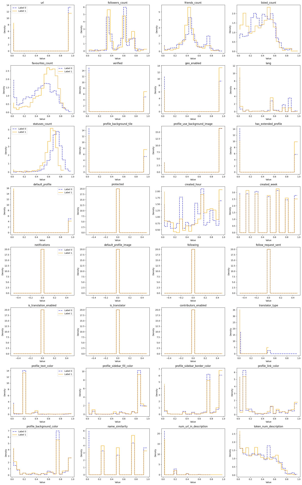
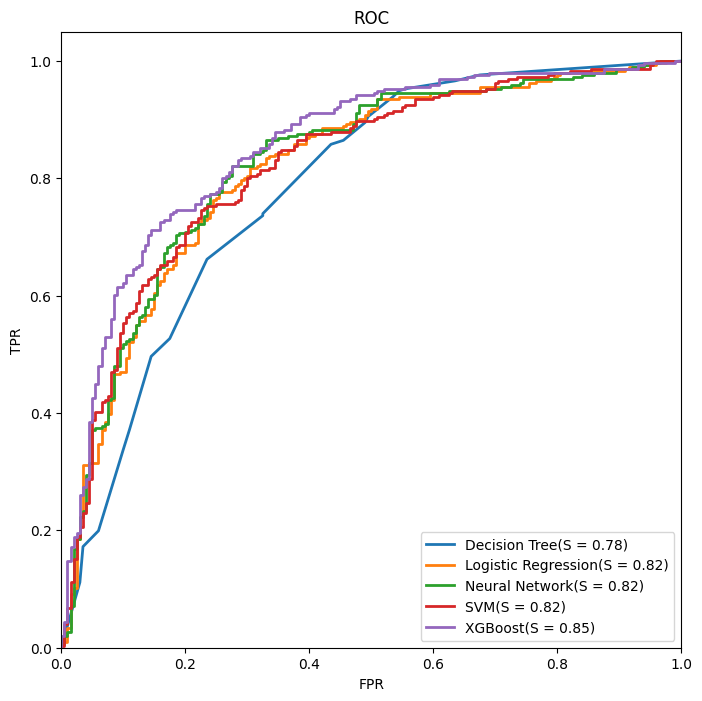
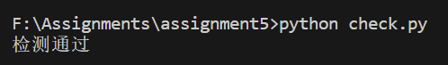
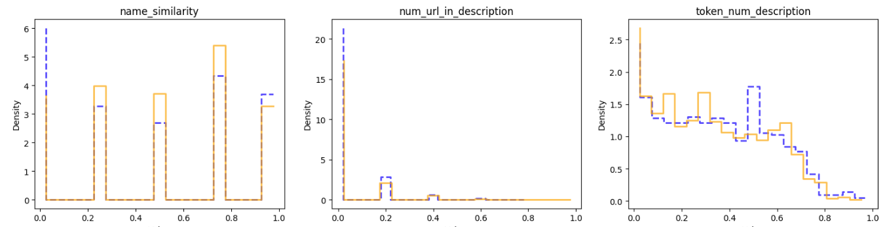

# 2023_USTC_ML

2023USTC机器学习概论综合实验，运用整个课程的所学知识，给定账户的一系列特征，预测其是否为虚假账号。需要对数据集进行进行数据预处理、数据划分、模型训练、模型验证、实验分析


### 实验原理

数据处理：

首先对数据进行编码，对于name，description等离散的，无法编码的数据，采用量化相似度、判断其中token的数量、判断url的数量等等来进行编码，最后得到特征矩阵并进行归一化

特征选择：

特征矩阵中存在一些冗余特征，对其进行无用特征删除来特征选择，由于采用PCA等降维方法会改变Dataframe的格式，所以通过观察特征分布图来手动删除无用特征

数据划分：

采用四折交叉验证来划分数据和训练样本，保证训练的准确程度

调参：

用网络搜索，遍历所有的参数组合，虽然计算量较大，但是可以找出最优的参数

模型训练与验证：

使用线性回归模型、决策树模型、神经网络模型、支持向量机以及XGBoost等分类模型来完成标签预测任务，调试参数，选择表现最好的模型应用在测试集得到最终的结果

假设检验：

使用t检验来验证模型的泛化性能


### 实验步骤

#### 读取数据

- 对于属性只有true 和 false 的特征，直接对其编码01即可
- 对于followers_count等数量很大的特征，对其取对数
- 对于create_at创建时间，分离出创建的小时以及星期几，对其编码，考虑是机器人的创建星期以及小时可能会跟人的创建账号时间不同，而月份，年份和创建时间的分和秒影响不大
- 对于语言，统计出17种不同的语言，也是进行编码1-17
- 对于颜色，由于颜色的数据都是十六进制字符串，所以就转换成十进制整数即可
- 处理name 和 screen_name，考虑用字符串相似度的函数来对这两个名字的相似度进行量化，并分为0-4级
- 对于description，我先考虑提取出其中的url，统计个人描述中url的数量。然后分离出emoji，用词法分析器统计description中token的数量
- 最后对得到的特征函数中心化，即得到初步的特征矩阵


#### 特征选取

各个特征的分布图如下


可以看到，其中有很多特征是只有一个值的，比如`protected`，所有的样本都是0，所以这种无用特征可以直接删除


##### 最后经特征选择，选择的特征：

- `created_hour`: 用户创建账号时间所在的小时
- `created_week`: 用户创建账号时间所在的星期几
- `name_similarity`: 用户的name和screen_name的相似程度，编码0-4
- `num_url_in_description`: 个人简介中连接的个数
- `token_num_description`: 个人简介中词token的数量

- `url`: 用户是否提供个人或商业网站链接。
- `followers_count`: 关注该用户的人数。
- `friends_count`: 该用户所关注的人数。
- `listed_count`: 用户被列入他人列表的次数，反映了受欢迎程度。
- `favourites_count`: 用户标记喜欢的推文或帖子数。
- `geo_enabled`: 用户是否开启地理位置服务。
- `verified`: 用户是否经过官方认证。
- `statuses_count`: 用户发布的总推文或帖子数。
- `lang`: 用户账号设置的语言，编码1-17。
- `is_translator`: 用户是否担任翻译员角色。
- `is_translation_enabled`: 用户是否开启翻译服务。
- `profile_background_color`: 用户资料的背景颜色。
- `profile_background_tile`: 用户资料背景是否为平铺式。
- `profile_link_color`: 用户资料中链接的颜色。
- `profile_sidebar_border_color`: 用户资料侧栏的边框颜色。
- `profile_sidebar_fill_color`: 用户资料侧栏的填充颜色。
- `profile_text_color`: 用户资料文本的颜色。
- `profile_use_background_image`: 用户是否使用资料背景图片。
- `has_extended_profile`: 用户是否开启扩展资料。
- `default_profile`: 用户是否使用默认资料设置。
- `default_profile_image`: 用户是否使用默认头像。
- `following`: 当前用户是否关注该用户。
- `translator_type`: 用户的类型，如翻译员等，编码0-2。


#### 模型训练与参数调整

##### 四折交叉验证

用四折交叉验证，输入到各个模型中，并进行参数调整，以决策树为例，代码如下

```python
clf = DecisionTreeClassifier(
    criterion='gini',
    splitter='best',
    max_depth=8,
    min_samples_split=10,
    min_samples_leaf=5,
    max_features=None,
    random_state=42           
)

kf = KFold(n_splits=4, shuffle=True, random_state=42)

scores = cross_val_score(clf, X, y, cv=kf, scoring='accuracy')

print("Accuracy scores for each fold:", scores)
print("Average accuracy:", np.mean(scores))
```


##### 网络搜索

运用GridSearchCV方法，系统地遍历多种参数的组合，找出最优参数，代码如下，以调试SVM的参数为例

```python
from sklearn.model_selection import GridSearchCV
param_grid = {
    'C': [0.1, 1, 10, 100],
    'gamma': [1, 0.1, 0.01, 0.001],
    'kernel': ['rbf', 'sigmoid', 'poly']
}

svm_clf = SVC()

grid_search = GridSearchCV(svm_clf, param_grid, cv=5, scoring='accuracy', verbose=2)

grid_search.fit(X_train, y_train)

best_params = grid_search.best_params_
best_score = grid_search.best_score_

print(f"Best parameters: {best_params}")
print(f"Best cross-validation accuracy: {best_score}")
```


各个模型的最优参数如下

##### 决策树：

```python
clf = DecisionTreeClassifier(
    criterion='entropy', 
    splitter='best',
    max_depth=5,
    min_samples_split=2,
    min_samples_leaf=2,
    max_features=None, 
    random_state=42
)
```

##### 神经网络：

```python
mlp = MLPClassifier(
    hidden_layer_sizes=(100,),
    max_iter=2000,
    activation='tanh',
    solver='adam',
    random_state=1,
    alpha=0.0001,
    learning_rate_init=0.001
)
```

##### SVM：

```python
svm_clf = SVC(kernel='rbf', C=10.0, gamma=0.1)
```

##### 线性回归：

```python
learning_rate = 0.01, num_iter=3000, fit_intercept=True, verbose=False
```

##### XGBoost:

```python
xgb_clf = XGBClassifier(
    n_estimators=100,
    learning_rate=0.01,
    max_depth=10,
    min_child_weight=2,
    gamma=0.1,
    subsample=0.6,
    colsample_bytree=0.8,
    objective='binary:logistic',
    eval_metric='logloss',
    use_label_encoder=False
)
```


### 实验结果

模型对应的四折交叉验证的准确率以及单次运行时间如下

| 模型                     | 准确率(四折交叉) | 运行时间(单次) |
| ------------------------ | ---------------- | -------------- |
| 线性回归模型（手工实现） | 0.6893           | 0.8s           |
| 决策树模型               | 0.7235           | 0.2s           |
| 神经网络模型             | 0.7613           | 1.6s           |
| 支持向量机（手工实现）   | 0.7422           | 0.6s           |
| XGBoost                  | 0.7814           | 0.8s           |
| 线性回归模型（调库）     | 0.7620           | 0.3s           |
| 支持向量机（调库）       | 0.7600           | 0.4s           |


#### ROC曲线

其中决策树模型的ROC是斜线构成的，经翻阅资料得知这是正常的，可以看到XGBoost的ROC曲线包裹了其他所有曲线，表现最好




### 假设检验

用四折交叉验证法的结果进行交叉验证t检验，以Decision Tree为例

特征删除前，未调参的四折交叉验证结果
0.68812877 0.67806841 0.72580645 0.65322581

特征删除后，调参之后的四折交叉验证结果
0.72032193 0.72837022 0.73991935 0.70564516

二者做差，并求均值与标准差

$\mu = 0.0371, \sigma = 0.0179$
$$
\tau_t = \left| \frac{\sqrt{n}\mu}{\sigma} \right| = 4.15 > t_{0.05,3} = 2.353
$$
故在显著性水平$\alpha=0.10$的条件下，认为特征删除后并调参的模型性能更优


### 模型验证

将准确率最高、ROC面积最大的XGBoost输入到测试集中，首先将test.json转换成特征矩阵，这个跟前面的代码基本一致，就不重复罗列，然后用XGBoost的模型预测X的结果即可

```python
scaler = MinMaxScaler()
X = pd.DataFrame(scaler.fit_transform(X), columns=X.columns)
y_1 = xgb_clf.predict(X)
```

```python
import json

with open('./data/test.json', 'r', encoding='utf-8') as file:
    data = json.load(file)

for i, item in enumerate(data):
    label = 'bot' if y_1[i] == 0 else 'human'
    item['label'] = label

with open('./data/test.json', 'w', encoding='utf-8') as file:
    json.dump(data, file, ensure_ascii=True, indent=4)

```


##### 运行check.py检查文件是否规范



文件规范


### 实验分析

本次实验，我根据课程一学期所学的知识，从一个初始的数据集开始，提取特征，降维，分离训练集和测试集，用网络搜索的方法调整参数，四折交叉验证判断准确率，训练了各个模型，并用ROC来找出最优的模型，运用假设检验的方法检验调参的正确性。

对于实验结果，其实基本都符合预期，XGBoost、决策树、神经网络和SVM都可以优秀的训练这次的特征矩阵，只有逻辑回归模型表现得稍微差一点点，不过用sklearn里面的逻辑回归的表现也很好，我认为是sklearn里面的模型泛化能力更佳，效果更好，所以也是合理的

收获不可谓不多，这次实验我经历了机器学习的全过程，关注整个实验流程的完整性和严谨性，最后的准确率也达到了我的预期，这是一次非常成功的实验


### Highlight

#### 特征选取

由于数据集中很多数据无法直接编码，比如name和screen_name，description等等

一般的现象是，对于真人，name和screen_name是会有些相似程度的，但是也不会完全相同或者完全不同，所以我采用了fuzzywuzzy库，用来量化name和screen_name之间的相似程度，这样就可以分层并量化了，并且特征提取效果较好

对于description，我通过对比，也是发现人和机器人的description的词数不会完全相同，故用了nltk库的分词器，提取description中的token，这样就可以编码并作为特征了，并且由于description里面有很多emoji，先把emoji都提取出来。观察特征分布图也能发现，这个特征也确实是有效的



#### 

#### 调参

运用GridSearchCV网络搜索方法，系统地遍历多种参数的组合，找出最优参数，比如XGBoost，我遍历了几万种参数的组合，找到了最优的参数，而且提升确实非常大，从一开始的70%准确率提升至接近80%


#### 假设检验

运用t检验，判断调参与特征选择是否有效，运用到了课堂所学知识，得出结论调参是非常有效的


#### ROC曲线

利用ROC曲线判断模型的优劣程度，更准确的选出最佳的模型XGBoost


